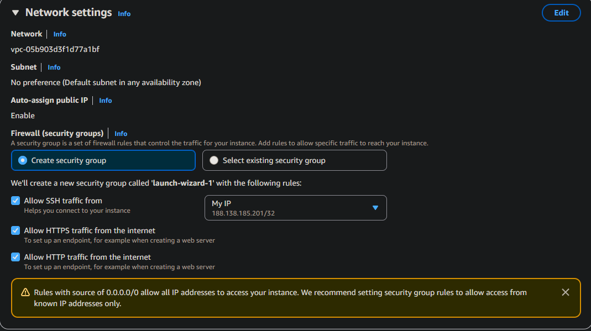

# Maximenco Stanislav

# Задание 0: 

Я создал аккаунт на AWS.

# Задание 1: 
Я создал IAM группу и выбрал политику AdministratotAccess

Данная политика предоставляет полный доступ ко всем ресурсам и сервисам AWS.

Далее я создал юзера и разрешил доступ к AWS Management Console

Далее я разлогинился и вошёл под другим аккаунтом cloudstudent

Далее я создал бюджет.

Потом я создал key pair

Далее security group

Затем я вставил скрипт, привёденный преподавателем

Далее прозвучал вопрос "Что такое User Data и какую роль выполняет данный скрипт? Для чего используется nginx?"
User Data — это скрипт, который автоматически выполняется при первом запуске EC2-инстанса для его настройки. Nginx используется как веб-сервер для обработки и распределения веб-запросов.

Далее я запустил instance

Всё работает, всё открывается

Все проверки прошли успешно, 3/3

Вот вкладка monitoring

Далее прозвучал вопрос:
В каких случаях важно включать детализированный мониторинг?
Ответ на него: Детализированный мониторинг включают, когда нужно точнее отслеживать производительность и нагрузку ресурсов, например для анализа проблем или оптимизации работы системы.

Вот скрины системных логов:

Вот instance screenshot

Подключился к инстансу по SSH

Далее прозвучал вопрос - "Почему в AWS нельзя использовать пароль для входа по SSH?"
Ответ на него следующий:
В AWS нельзя использовать пароль для входа по SSH, чтобы повысить безопасность — доступ разрешён только по ключам, которые сложнее взломать, чем пароли.

Далее прозвучал вопрос: Что делает команда scp?
Ответ на нёё: Команда scp используется для копирования файлов между локальным компьютером и удалённым сервером по SSH.

Далее после всех манипуляций и переноса html файлов на сервер, получилась следующая картина:

Последним вопросом являлся - "Чем «Stop» отличается от «Terminate»"
Ответ на него: Stop временно останавливает инстанс, сохраняя данные, а Terminate полностью удаляет его без возможности восстановления.